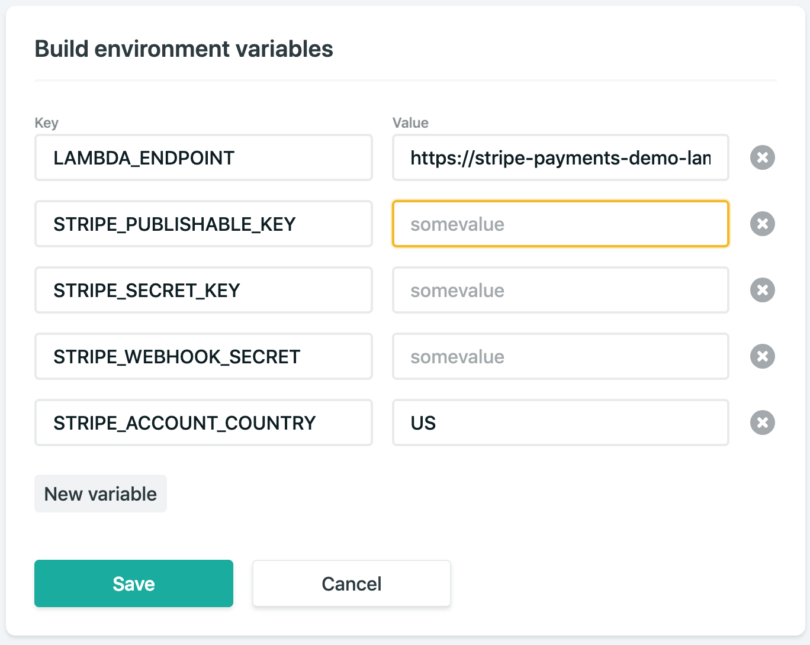
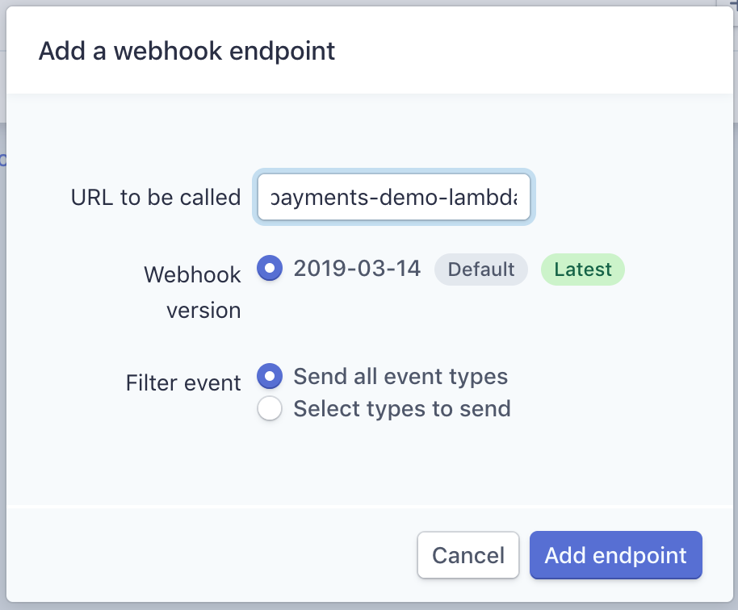

# Netlify-Stripe-Payments-Demo
.  

The [Stripe Payments Demo](stripe-payments-demo) converted to work on Netlify with Netlify Lambda. Read their page for information.

Enter your Stripe API keys, webhook secret and country into the 'Build environment variables' under 'Deploy Settings' in Netlify. Like below:

And add your webhook endpoint in your Stripe Developer dashboard.

## Payments Integration
The frontend code for the demo is in the 'dist/' directory.

The core logic of the Stripe integration is mostly contained within two files:

'dist/javascripts/payments.js' creates the payment experience on the frontend using Stripe Elements.
The functions folders defines the serverless functions on the backend that create Stripe charges and receive webhook events.

### Beyond Cards: Payments Sources for Europe and Asia
This demo also shows how to reach customers in Europe and Asia by supporting their preferred way to pay online. It supports payment methods such as ACH credit transfers, Alipay, Bancontact, iDEAL, Giropay, SEPA Direct Debit, SOFORT, and WeChat Pay. Be sure to turn these on in your Stripe dashboard if you plan to use these live.

The app also supports both Multibanco and EPS which are currently in Public Beta on Stripe. 
# Getting Started
1. Install with `npm run install`, this also installs the Stripe CLI assuming you have [Brew](https://brew.sh)
2. Run `npm run build`
3. Then to set up the products in Stripe run `npm run setup-products`
4. Run `npm run dev` to run a local server with Netlify Dev and the Stripe CLI.
